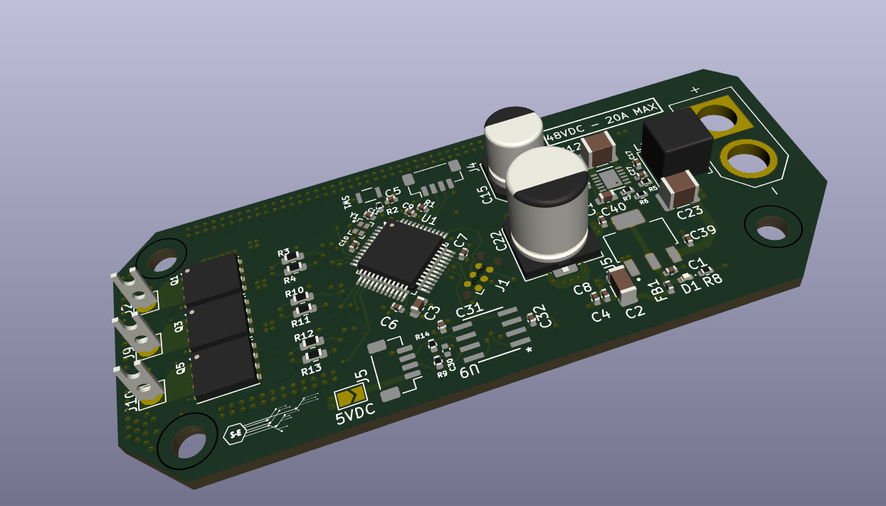

# **OpenSource CAN FD Compatible Motor Board**

This Board was designed as a part of a larger project in the making for a Robotic Arm Actuator System. The board can manipulate a BLDC motor from 24V to 48V (designed around LiPo battery packs) and with a max current rating of 15 A. 

## Board Information
- STM32F103 Central Microcontroller
- Sensor-less or Wioth Sensor Control strategies 
- 24V to 48V - 20 A
